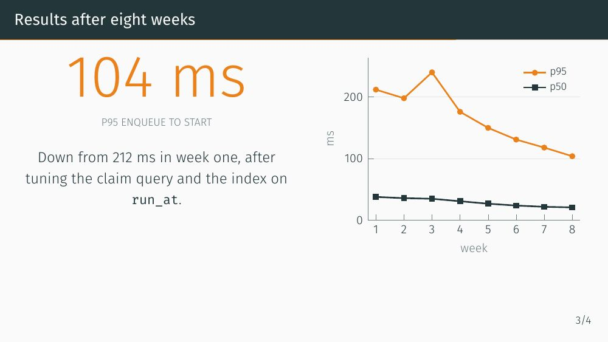
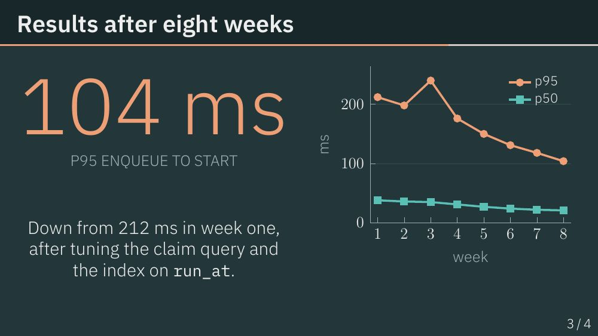
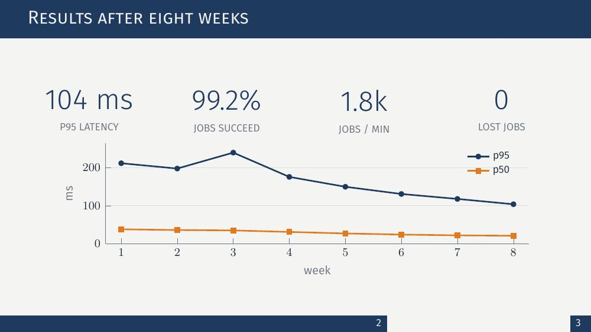
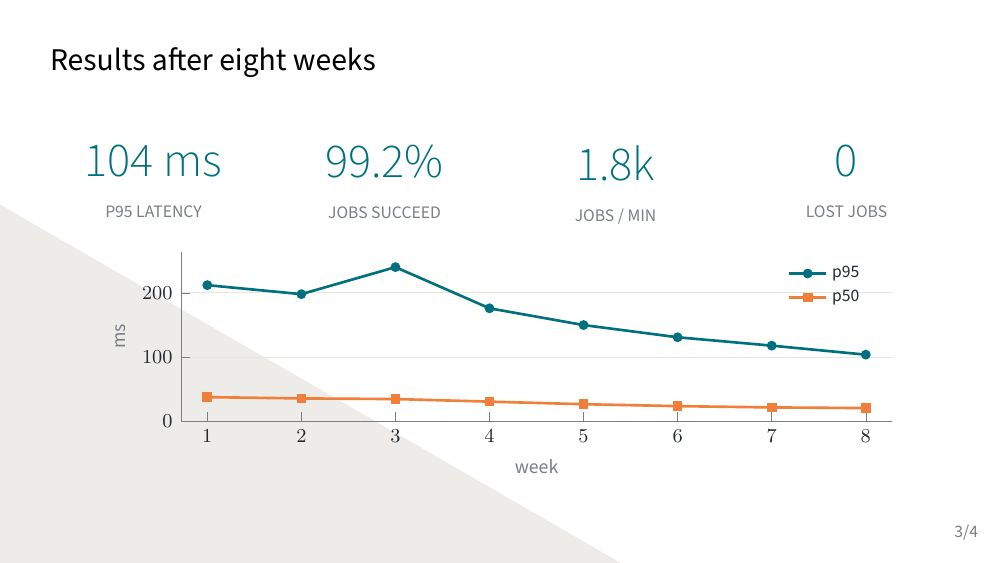
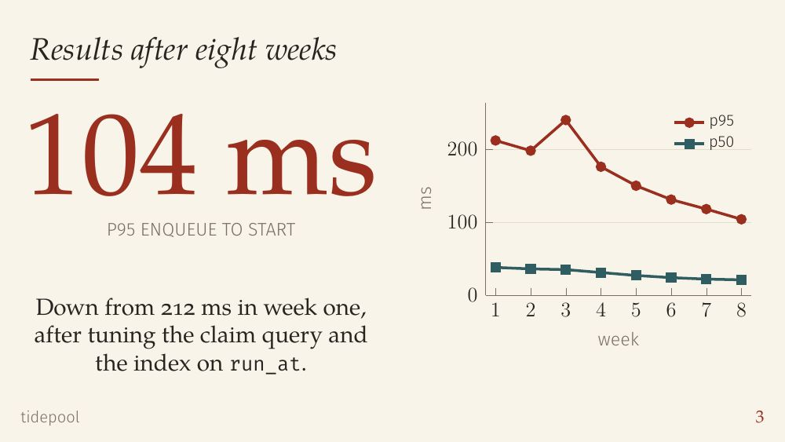
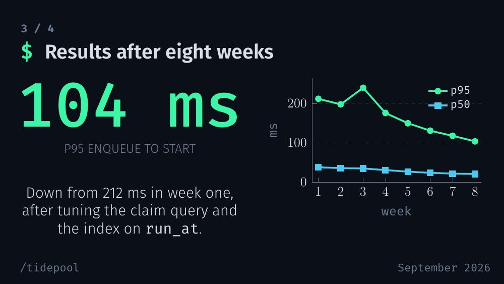

# devreport

**The project report that can't make up your results.**

Drop in a project (a `.zip`, a GitHub link, or loose logs, notes, CSVs and screenshots) and devreport writes a LaTeX report or a Beamer slide deck about it, compiled to PDF while you watch. It's for student builders who have to write up a hackathon, coursework or side project and would rather keep building. Ask a chatbot to write up a project and it will invent a results section. In devreport, plain code analyses the files first and every chart and stat comes from that analysis. The model only writes the prose around them.

## Samples

All generated by devreport; the report and Midnight deck are about devreport itself.

- [Report](samples/report.pdf): research-paper layout with abstract, numbered sections and figures
- [Slides, Midnight theme](samples/slides-midnight.pdf)
- [Slides from an uploaded PowerPoint template](samples/slides-custom-template.pdf)

| Metropolis | Moloch | Focus |
|---|---|---|
|  |  |  |
| **Trigon** | **Paper** | **Midnight** |
|  |  |  |

## Features

- **Any input.** Loose files, a `.zip`, a public GitHub link, or a mix.
- **Asks only when it has to.** If the README, notes and code don't say what the project does or who it's for, you get up to 3 questions in the feed. Answer or skip, and the same agent session carries on. Most repos with a README get none.
- **The length you pick.** 5–25 slides or 2–10 pages. The agent aims to land within one of it, cuts the least important sections when there's too much, and goes shorter rather than pad.
- **Reports look like papers.** One standard LaTeX article layout: Latin Modern, abstract, numbered sections, booktabs tables, numbered figures with grey pgfplots charts.
- **7 slide themes, switchable after the build.** Paper, Midnight, Metropolis, Moloch, Focus, Trigon and Madrid, each with a hover preview. Switching recompiles with `tectonic` in about 1.2 s without calling the model, and every compiled theme is cached, so switching back is instant.
- **Your own PowerPoint template.** Upload a `.pptx` and the deck picks up its colours, fonts, logo and rough layout.
- **A viewer built for review.** A pdf.js viewer with slide thumbnails, a present mode, and notes pinned to a page.
- **Revise.** Send page notes or general notes and the agent edits the existing deck. Earlier versions are kept as backups.
- **Add material later.** Attach more files, a zip, a repo or notes to a finished job. The collector re-runs and the agent works the new material in.
- **A live log by phase.** Uploading, Analysing, Reading, Writing, Compiling, Polishing, Done, each updated in place. Compile errors and raw steps sit under "Show details". A reload or dropped connection picks the feed back up.
- **Any model.** The default engine is Claude Code headless. The `ai` engine runs my own agent loop on the Vercel AI SDK with OpenAI, Anthropic, Google, OpenRouter, or any OpenAI-compatible server, local Ollama included.

## How it works

```
upload / .zip / GitHub link
  → server.js      safe intake into jobs/<id>/input/
  → collect.js     git history, logs, tables, notes, images → data/*.csv + facts.json   (plain code, tested)
  → agent          reads facts.json, the notes and key code files
                   missing what the project is or who it's for? writes questions.json and stops
                   → you answer or skip → the same session resumes
  → agent          writes main.tex using only its sandboxed tools (read, write, edit, compile;
                   on the cli engine also the Skill tool)
  → tectonic       compiles; the agent reads the errors, fixes, recompiles
  → main.pdf       shown in the viewer, with the .tex to download
```

The agent follows a written pipeline in [`.claude/skills/devreport/SKILL.md`](.claude/skills/devreport/SKILL.md), with tested chart snippets in `charts.md`.

### Design decisions

- **Charts plot only computed CSVs.** Every chart is pgfplots reading a file `collect.js` wrote, e.g. `\addplot table{data/commits_per_day.csv}`. The agent never types a number into a chart, and stat numbers come from `facts.json`.
- **The code analyses, the model writes prose.** Milestones from git history (vendored and generated code left out), likely entry points, recurring errors grouped by replacing numbers and IDs with placeholders, and column types in your own CSV/JSON are all deterministic and covered by `test.js`. Commit counts and lines of code aren't offered as charts, since they don't show that a project works.
- **Never invent.** Uploaded files are the only source. Lessons learned and what's next are never asked for, so with no source those sections are left out.
- **One `main.tex` for every theme.** `main.tex` loads its look with one line, `\input{theme.tex}`. Each theme is a small adapter `.sty` on a shared core (`devreport-core.sty`) that defines the same `\dr*` colours, chart styles, stat tiles and layout macros. Switching theme rewrites `theme.tex` and recompiles.
- **Themes own the type scale.** The skill bans raw font sizes, so the agent uses `\drTitle`, `\drH`, `\drBody`, `\drStat` and the rest, and each theme sets those sizes to suit its own frame. [`scripts/fill.py`](scripts/fill.py) measures how much of each slide's body the content fills.
- **A sandbox made of tools.** The cli engine runs `claude -p` with only `Read,Write(./**),Edit(./**),Bash(tectonic:*),Skill`: no general shell, and writes stay inside the job folder. The `ai` engine is stricter. It has four tools, and every path goes through one check that refuses anything outside the job folder, any symlink, and the server's own files.

### Security

- **Zips:** 50 MB upload cap. The unpacked size is summed from `unzip -l` before extracting and refused over 200 MB (zip bombs), entries that resolve outside `input/` are rejected (zip-slip), and symlinks are deleted afterwards.
- **GitHub links:** normalised, then matched against `^https://github.com/<owner>/<repo>$` and cloned with `execFile` (no shell), `GIT_TERMINAL_PROMPT=0` and a timeout. On untrusted repos only `git log` runs, never anything that triggers hooks.
- **Prompt injection:** the skill says everything under `input/`, `data/`, `template/` and every string in `facts.json` is untrusted data about a project, never instructions. Even if that rule fails, the tool sandbox above limits what the agent can do.

## Setup

Requirements: macOS or Linux, Node 22+, [`tectonic`](https://tectonic-typesetting.github.io), `git` and `unzip`. Then either a logged-in [Claude Code](https://claude.com/claude-code) (default engine) or an API key for one of the providers under [Engines](#engines).

```bash
brew install tectonic          # Linux: see https://tectonic-typesetting.github.io
git clone https://github.com/Celibistrial/devreport && cd devreport
npm install                    # AI SDK packages for the ai engine; the cli engine's server is Node stdlib only
cp .env.example .env           # pick the engine/model and paste your API key (optional for the default engine)
node --test test.js            # 18 tests; bare `node --test` would also pick up tests inside cloned jobs/
node server.js                 # http://127.0.0.1:3000  (PORT=3002 node server.js for another port)
```

A run takes about 1–3 minutes with a strong model and runs on **your own** credentials: a Claude Code login, or an API key for any supported provider (OpenRouter, OpenAI, Anthropic, Google, or any OpenAI-compatible server such as Groq, DeepSeek or a local Ollama). Settings and keys live in `.env` (gitignored; see `.env.example`), and real environment variables override it. See [Engines](#engines). There is no public hosted version on purpose, since it would run strangers' jobs on one person's account.

## Engines

`DEVREPORT_ENGINE` picks who runs the agent (default `cli`):

- **cli**: Claude Code headless (`claude -p`) with the tool allowlist above.
- **ai**: `agent.js`, our own loop on the [Vercel AI SDK](https://ai-sdk.dev) (Node 22+, `npm install` first). The model gets exactly four tools, `read_file`, `write_file`, `edit_file` and `compile` (`tectonic main.tex`, no arguments), and every path goes through one check that refuses anything outside the job folder, any symlink, and the server's own files (job.json, facts.json, data/, input/ ...). The skill files are readable, not writable. So the sandbox is tighter than the cli allowlist, and the model is pluggable via `DEVREPORT_MODEL=<provider>:<model>` (everything after the first colon is the model id):

| Provider | Env vars | Example `DEVREPORT_MODEL` |
|---|---|---|
| `claude-code` (default) | none, uses your Claude Code login | `claude-code:opus`, `claude-code:sonnet` |
| `openai-compatible` | `DEVREPORT_BASE_URL` (the `/v1` URL), `DEVREPORT_API_KEY` if the server wants one | `openai-compatible:qwen3:8b` |
| `openrouter` | `OPENROUTER_API_KEY` | `openrouter:anthropic/claude-sonnet-4.5` |
| `anthropic` | `ANTHROPIC_API_KEY` | `anthropic:claude-sonnet-4-5` |
| `openai` | `OPENAI_API_KEY` | `openai:gpt-5` |
| `google` | `GOOGLE_GENERATIVE_AI_API_KEY` | `google:gemini-2.5-pro` |

`openai-compatible` covers any server that speaks the OpenAI chat API: Groq (`https://api.groq.com/openai/v1`), Together (`https://api.together.xyz/v1`), DeepSeek (`https://api.deepseek.com/v1`), OpenRouter (`https://openrouter.ai/api/v1`), and local ones like Ollama (`http://127.0.0.1:11434/v1`), LM Studio (`http://127.0.0.1:1234/v1`) or vLLM. A missing key or URL stops the run with a message naming the variable.

With `claude-code`, our tools go in as an in-process MCP server and every built-in Claude Code tool is switched off. With every other provider the AI SDK runs the tool loop, with guard rails for weaker models: at most 80 model steps, retried API calls, `facts.json` handed over up front, bad tool arguments sent back as an error the model can fix, the same call three times in a row refused, a compile error inside a `\dr*` macro answered with that macro's usage, and a model that stops before there is a `main.pdf` (and didn't ask questions) told up to twice to compile. The `openai-compatible` provider can't pass images in tool results, so the model gets a short note instead of screenshots or rendered pages.

```bash
npm install
# in .env:  DEVREPORT_ENGINE=ai  DEVREPORT_MODEL=claude-code:opus
# or inline, e.g.:
DEVREPORT_ENGINE=ai DEVREPORT_MODEL=claude-code:opus node server.js
DEVREPORT_ENGINE=ai DEVREPORT_MODEL=openai:gpt-5 OPENAI_API_KEY=sk-... node server.js
DEVREPORT_ENGINE=ai DEVREPORT_MODEL=openai-compatible:llama-3.3-70b-versatile \
  DEVREPORT_BASE_URL=https://api.groq.com/openai/v1 DEVREPORT_API_KEY=gsk_... node server.js
```

Fully local, no key, with [Ollama](https://ollama.com):

```bash
brew install ollama
OLLAMA_CONTEXT_LENGTH=32768 ollama serve      # the skill alone is ~6k tokens; Ollama's default context is too small
ollama pull qwen3:8b
DEVREPORT_ENGINE=ai DEVREPORT_MODEL=openai-compatible:qwen3:8b DEVREPORT_BASE_URL=http://127.0.0.1:11434/v1 \
  DEVREPORT_REASONING_EFFORT=none DEVREPORT_TIMEOUT_MIN=30 node server.js
```

`DEVREPORT_REASONING_EFFORT` is passed as `reasoning_effort` (`none` turns off qwen3's thinking, which made each step 1–3 minutes instead of seconds). `DEVREPORT_TIMEOUT_MIN` raises the 10-minute agent timeout. On an M4 with 16 GB, qwen3:8b built the 01 sample deck in about 7 minutes: real names and features from the README, the screenshot placed, a flow and a timeline, but text overflow, overlapping timeline dates and no charts. It does not decide to ask questions on its own, and sometimes can't get past a compile error. Expect Claude-level decks only from Claude, GPT-5 or Gemini class models.

## Project layout

| Path | Job |
|---|---|
| `server.js` | HTTP server (Node stdlib): uploads, zip/GitHub intake, runs the collector and the agent, theme switches, revisions, SSE progress |
| `collect.js` | Deterministic parsing of inputs → `data/*.csv` + `facts.json` |
| `pptx.js` | `.pptx` template → colours, fonts, layout boxes, media and thumbnail in `template/` |
| `agent.js` | The `ai` engine: AI SDK agent loop with four sandboxed tools, printing the same stream-json as `claude -p` |
| `index.html` | The whole UI in one file: form, live feed, pdf.js viewer, theme picker, revise panel |
| `test.js` | `node:test` tests for the collector, the template extractor and the agent's sandbox |
| `.claude/skills/devreport/` | The pipeline the agent follows (`SKILL.md`), chart snippets, prompts, themes, previews |
| `.claude/skills/humanizer/` | Vendored humanizer skill (MIT, see its LICENSE) |
| `scripts/fill.py`, `scripts/previews.sh` | Measure slide fill; regenerate theme previews (need `pdftoppm`, and Pillow for fill.py) |
| `samples/` | PDFs devreport generated about itself |

## Limits and what's next

- Local only, one job at a time.
- Template import copies colours, fonts, the logo and rough layout, not shapes, gradients or animations. Fonts that aren't installed fall back to a close TeX Gyre font.
- 16-bit PNG screenshots are re-encoded with `sips`, which is macOS only.
- The page loads pdf.js from cdnjs and fonts from Google Fonts, so the browser needs a network connection.
- Prompt injection: uploaded text goes to an agent that can write files in the job folder. The tool sandbox contains it, but only run devreport on material you trust.
- Small models (tested: qwen3:8b on Ollama) produce a usable deck, but with text overflow and no charts.
- Next: more than one job at a time, and a `sips` replacement so 16-bit PNGs work on Linux.

## What I learned

- **Keep the numbers away from the model.** I decided early that `collect.js` computes every CSV and the LaTeX only points at those files, and that stat numbers are copied from `facts.json`, never worked out by the model. A wrong number in a chart can then only come from a bug in code I can test.
- **A prompt rule loses to the data it's given.** The skill used to say "use every chart in `facts.charts`", and the collector emitted charts for commits per hour, top files and commit types. So early reports were full of vanity metrics about my commit habits. I fixed it in the collector: those CSVs are still written, but they're no longer listed as charts, so there's nothing for the rule to pull in. Fixing what the model is given held up better than adding another rule to the prompt.
- **Layout problems are a type-scale problem.** Slides kept coming out with large empty areas, and each theme spaced things differently. Banning raw font sizes and having each theme own one type scale (`\drTitle`, `\drBody` ...) mostly fixed it. I stopped judging fill by eye and wrote `scripts/fill.py` to measure it per slide.
- **Test the sandbox, don't assume it.** With a bare `Write` in the allowlist, `claude -p` could write to `../escape.txt`. `Write(./**)` blocked it. For my own agent I put every path through one function that refuses escapes, symlinks and the server's files, and `test.js` checks it.
- **SSE streams drop silently.** A browser or proxy can close a stream that has been quiet while the agent thinks. The server now sends a ping every 15 seconds, and the client reconnects, replays the feed without duplicating steps, and reattaches to a running job after a page reload.
- **Weaker models fail in predictable ways.** When I made the agent loop provider-agnostic and ran the same skill on smaller models (qwen3:8b on Ollama, for one), they repeated the same call, stopped before there was a PDF, or got stuck on compile errors in the `\dr*` macros. Each became a guard rail in `agent.js`: repeated calls refused, up to two nudges to compile, and the macro's usage sent back with the error.


## Third-party credits

- [humanizer](.claude/skills/humanizer/) skill, MIT (see its LICENSE)
- [Metropolis](https://github.com/matze/mtheme) Beamer theme by Matthias Vogelgesang, loaded from tectonic's TeX bundle (CC BY-SA 4.0)
- [Moloch](https://github.com/jolars/moloch) Beamer theme by Johan Larsson, vendored in `themes/vendor/moloch/` (CC BY-SA 4.0, see its LICENSE)
- [Focus](https://github.com/elauksap/focus-beamertheme) Beamer theme by Pasquale Claudio Africa, vendored in `themes/vendor/focus/` (GPL-3.0, see its LICENSE)
- Trigon Beamer theme (CTAN, loaded from tectonic's bundle) and Beamer's built-in Madrid theme
- [pdf.js](https://mozilla.github.io/pdf.js/) by Mozilla, loaded from cdnjs for the in-page PDF viewer (Apache-2.0)
- [Lucide](https://lucide.dev) icons in the live feed, path data copied into `index.html` (ISC)
- [pgfplots](https://ctan.org/pkg/pgfplots), [pgf-pie](https://ctan.org/pkg/pgf-pie) and [tectonic](https://tectonic-typesetting.github.io)


## License

© 2026 Gaurav. All rights reserved; see [LICENSE](LICENSE). Source is public for hackathon judging. Third-party themes and skills keep their own licenses (listed above).
